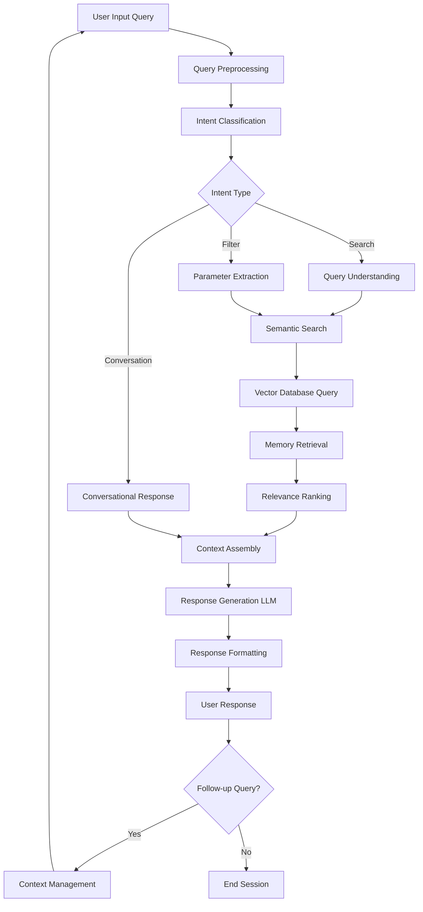
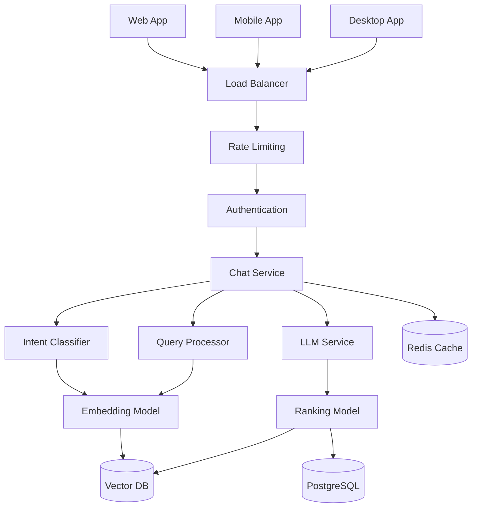

<div align="center">

# 🧬 Applied AI Projects in Healthcare & Clinical Operations  
### *Turning fragmented data into intelligent, actionable insight.*


</div>

---

> **Independent applied AI projects exploring knowledge integration and predictive modeling in healthcare and clinical operations.**  
> These initiatives bridge theoretical AI and real-world operations — investigating how intelligent systems can enhance workflow efficiency, knowledge synthesis, and predictive decision-making.


## 🌟 Why This Matters

Healthcare generates terabytes of data daily — yet only a fraction becomes **actionable knowledge**.  
These projects aim to change that by applying AI to **transform operational noise into structured intelligence**.

They explore questions such as:
- How can LLMs remember and reason over workflows?  
- What would a “knowledge memory” look like for regulated industries?  
- Can we predict a clinical trial’s success before it begins?

This repository documents the *exploration*, not just the outcome.

---

## 🧠 Projects

---

### 1. 🧩 **Total Recall – Knowledge Integration Assistant**

**Objective:**  
To build an AI system that unifies multi-channel communication (email, chat, IoT) into a single, queryable interface for actionable insights.

**Current Status:**  
- Gmail-integrated prototype developed  
- Refining parsing logic, entity recognition, and contextual summarization  

---

#### 🧠 Memory Chatbot Model Pipeline**



⚙️ Pipeline Stages
	•	Query Preprocessing: Cleans and normalizes user input.
	•	Intent Classification: Determines intent — Search, Filter, or Conversation.
	•	Semantic Search: Converts queries into embeddings for vector similarity search.
	•	Memory Retrieval: Ranks results by similarity, recency, and engagement.
	•	Response Generation: LLM synthesizes contextual answers.
	•	Context Management: Maintains session continuity across multi-turn dialogues.

⸻

🧩 System Architecture

Performance Targets:
	•	Intent classification: < 100ms
	•	Vector search: < 200ms
	•	LLM response: < 2s
	•	Total latency: < 3s

Security:
	•	End-to-end encryption
	•	JWT authentication
	•	User-specific memory isolation
	•	GDPR compliance

Key Technologies:
OpenAI, Sentence Transformers, Pinecone, GPT-4, BERT, Cohere, Redis

Skills & Techniques:
Natural Language Processing (NLP), AI, Information Architecture, Workflow Automation, Data Integration

⸻

2. 🧪 Clinical Trial Success Predictor

Objective:
To predict clinical trial outcomes using operational and design features, supporting data-driven decision-making and risk assessment.

Current Status:
	•	ML framework deployed using Balanced Random Forest
	•	Expanding dataset with real-world data from ClinicalTrials.gov
	•	Retraining model for context awareness (rare disease & pediatric trials)

⸻

🧬 Clinical Trial Outcome Predictor – Model Pipeline

```mermaid
	graph TB
    subgraph v20["v2.0 - CURRENT DEPLOYED"]
        A1[Original Dataset - 1,138 trials]
        A2[Filter: Remove ≤20 participants → 872 trials]
        A3[Feature Engineering: 9 → 13 features]
        A4[Model: Balanced Random Forest]
        A5[Result: 84.6% accuracy]
        A6[Issue: Rare disease flags non-functional]
        A1 --> A2 --> A3 --> A4 --> A5 --> A6
    end

    subgraph v22["v2.2 - IN PROGRESS"]
        B1[ClinicalTrials.gov Data - 10,000 trials]
        B2[Define Success/Failure Labels]
        B3[Feature Mapping & Cleaning]
        B4[Feature Engineering: 11 → 15 features]
        B5[Balanced Random Forest - Context Learning]
        B6[Result: Context-aware Predictions]
        B1 --> B2 --> B3 --> B4 --> B5 --> B6
    end
```


### 🧩 Version Comparison

| 🔢 **Version** | 🧪 **Trials** | ⚙️ **Features** | 🧠 **Trial Type** | 🚀 **Status** |
|:---------------|:--------------|:----------------|:------------------|:--------------|
| **v2.0** | 872 | 13 | Not functional | ❌ Abandoned *(all zeros)* |
| **v2.1** | 872 | 15 | All zeros | ✅ Deployed |
| **v2.2** | ~6,000 | 15 | Real labeled data | 🔄 In Progress |


🧩 Feature List

v2.0 (13 Features):
start_year, phase_numeric, is_industry_sponsor, is_nih_sponsor,
is_interventional, is_drug_intervention, is_device_intervention,
enrollment_log, enrollment_category, duration_log, duration_category,
phase_x_enrollment, industry_x_drug

v2.2 (+2 New Features):
is_rare_disease, is_pediatric

⸻

🧭 User Interaction (Streamlit App)
	1.	Input: User enters 11 trial characteristics
	2.	Processing: Calculates engineered features (logs, categories, interactions)
	3.	Prediction: Returns success probability
	4.	Output: Displays percentage, risk profile, and feature importance

Skills & Techniques:
Machine Learning, Predictive Analytics, Clinical Operations, Data Science, Bias Mitigation

⸻

🤝 Getting Involved

These are independent applied AI research projects.
Feedback, collaboration, and discussion are welcome.

📧 Contact: gudipati.aditi@gmail.com
🔗 LinkedIn: linkedin.com/in/aditigudipati

<div align="center">

“AI doesn’t replace human judgment — it amplifies it.”
🧬 Exploring intelligence where data meets decision.

</div>
```


