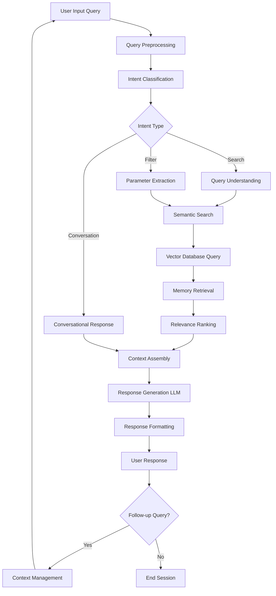
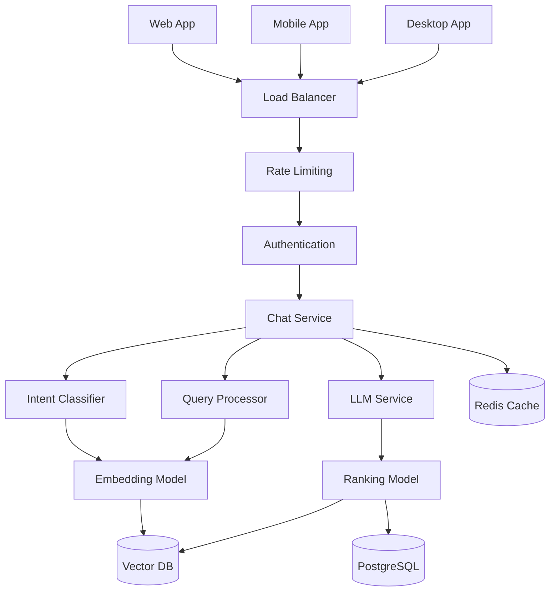

# Applied AI Projects in Healthcare & Clinical Operations
Independent AI projects exploring knowledge integration and predictive modeling in healthcare and clinical operations.
Overview

These projects investigate how AI can improve workflow efficiency, knowledge synthesis, and predictive decision-making in healthcare. They are independent, applied research initiatives, bridging theoretical AI with real-world operations.

Focus Areas:

Knowledge integration and intelligent data retrieval

Predictive analytics for clinical trial outcomes

Workflow automation and operational optimization

Projects
1. Total Recall – Knowledge Integration Assistant

Objective:
To build an AI system that unifies multi-channel communication (email, chat, IoT) into a single, queryable interface for actionable insights.

Current Status:

Gmail-integrated prototype developed

Refining parsing logic, entity recognition, and contextual summarization

# Memory Chatbot Model Pipeline

## Overview
This pipeline architecture enables a conversational chatbot interface for searching and retrieving memories in a memory-as-a-service platform.

## Pipeline Flow



## Pipeline Stages

### Query Preprocessing
Cleans and normalizes user input by removing noise, correcting spelling, and standardizing format.

### Intent Classification
Determines the user intent: Search, Filter, or Conversation.

### Query Understanding
Extracts search terms, dates, categories, tags, and contextual clues.

### Semantic Search
Converts query into embeddings and performs similarity search in vector database.

### Memory Retrieval and Ranking
Fetches matching memories and ranks by similarity score, recency, and engagement.

### Context Assembly
Combines retrieved memories with conversation context.

### Response Generation
LLM generates natural language responses with search results and suggestions.

### Context Management
Maintains conversation history for multi-turn dialogues.

## Key Technologies

- Embedding Models: OpenAI, Sentence Transformers, Cohere
- Vector Database: Pinecone, Weaviate, Qdrant, Chroma
- LLM: GPT-4, Claude, Llama
- Intent Classification: BERT, rule-based systems

## API Endpoints

### Chat Message Endpoint
POST /api/chat/message

Request:
```json
{
  "session_id": "uuid",
  "user_id": "user123",
  "message": "Show me photos from July"
}
```

Response:
```json
{
  "response": "I found 24 photos from July",
  "memories": [],
  "suggestions": [],
  "session_id": "uuid"
}
```

### Session Management
POST /api/chat/session

### Context History
GET /api/chat/history

## System Architecture



## Performance Targets

- Intent classification: under 100ms
- Vector search: under 200ms
- LLM response: under 2s
- Total end-to-end: under 3s

## Security

- End-to-end encryption
- JWT authentication
- User-specific memory isolation
- GDPR compliance

Key Features:

Centralized knowledge retrieval from multiple communication streams

Context-aware responses to user queries

Designed as an applied AI experiment in workflow optimization

Skills & Techniques:
Natural Language Processing (NLP), AI, Information Architecture, Workflow Automation, Data Integration

2. Clinical Trial Success Predictor

Objective:
To predict clinical trial outcomes using operational and design features, supporting data-driven decision-making and risk assessment.

Current Status:

Developing machine learning framework

Scaling and re-weighting datasets to address bias, especially for rare diseases

Key Features:

Early identification of operational risks in trial design

Modeling impact of trial characteristics on success probability

Applied AI experiment in predictive analytics for clinical operations

### Clinical Trial Success Predictor – Model Pipeline
This pipeline shows the evolution of a machine learning model that predicts whether clinical trials will succeed or fail based on their design characteristics.
The Three Versions
v2.0 (Current - Deployed)
What it does: Predicts trial success using 872 historical trials
Key steps:

Filtering - Removes trials with ≤20 participants (these mostly failed due to recruitment issues, not trial quality)
Feature Engineering - Transforms 9 basic inputs into 13 sophisticated features using log transformations, categorical binning, and interaction terms
Training - Uses Balanced Random Forest to handle the imbalanced dataset (more successes than failures)
Result - 84.6% accurate model that works well for typical trials

Limitation: Doesn't understand context - treats a 30-person rare disease trial the same as a 30-person diabetes trial
v2.1 (Failed Attempt)
What we tried: Added rare disease and pediatric checkboxes to provide context
Why it failed: Training data had all rare disease/pediatric flags set to 0, so the model learned these features are meaningless. In production, users check these boxes but the model ignores them.
Outcome: Abandoned this approach
v2.2 (In Progress)
What we're doing: Retrain using real-world data from ClinicalTrials.gov that has actual rare disease and pediatric trials
Key improvements:

Larger dataset - 10,000 trials instead of 872
Real labels - Actual rare disease/pediatric flags from trial metadata
Context learning - Model will learn: "small enrollment + rare disease = normal pattern" vs "small enrollment + common disease = warning sign"

Expected outcome: Checkboxes will actually affect predictions, making the model context-aware
How Users Interact (Streamlit App)

Input - User enters 11 trial characteristics
Processing - App calculates engineered features (logs, categories, interactions)
Prediction - Model returns success probability
Output - User sees percentage, risk assessment, and recommendations

The pipeline represents a progression from a working but limited model (v2.0) toward a more sophisticated, context-aware system (v2.2) that understands when small trials are legitimately designed that way versus when they signal problems.

# Clinical Trial Outcome Predictor - Model Pipeline

```mermaid
graph TB
    subgraph v20["v2.0 - CURRENT DEPLOYED"]
        A1[Original Dataset<br/>1,138 trials<br/>features.csv + target.csv]
        A2[Filter: Remove ≤20 enrollment<br/>Removed 266 trials<br/>Final: 872 trials]
        A3[Feature Engineering<br/>Log transforms<br/>Categories<br/>Interactions<br/>9 inputs → 13 features]
        A4[Model Training<br/>Balanced Random Forest<br/>200 estimators, max_depth=8]
        A5[Model Output<br/>balanced_random_forest.pkl<br/>scaler.pkl<br/>13 features]
        A6[Issue: v2.1<br/>Added rare_disease/pediatric<br/>All set to 0<br/>Non-functional]
        
        A1 --> A2
        A2 --> A3
        A3 --> A4
        A4 --> A5
        A5 --> A6
    end

    subgraph v22["v2.2 - IN PROGRESS"]
        B1[ClinicalTrials.gov Data<br/>10,000 trials<br/>processed_trials.csv<br/>Real rare_disease/pediatric flags]
        B2[Create Outcomes<br/>Define success/failure<br/>COMPLETED = success?<br/>Binary target]
        B3[Feature Mapping<br/>Map API fields to 9 features<br/>Calculate duration<br/>Extract sponsors]
        B4[Filter & Clean<br/>Remove ≤20 enrollment<br/>Remove missing data<br/>Expected: 5,000-8,000 trials]
        B5[Feature Engineering<br/>Same as v2.0<br/>11 inputs → 15 features<br/>Real trial type values]
        B6[Model Training<br/>Balanced Random Forest<br/>Learns trial type context]
        B7[Expected Result<br/>Context-aware predictions<br/>Checkboxes functional<br/>Robust for edge cases]
        
        B1 --> B2
        B2 --> B3
        B3 --> B4
        B4 --> B5
        B5 --> B6
        B6 --> B7
    end

    subgraph app["Streamlit App - Prediction Pipeline"]
        C1[User Inputs 11 features<br/>Enrollment, Duration, Phase<br/>Sponsors, Interventions<br/>Rare Disease, Pediatric]
        C2[Feature Engineering<br/>Calculate log transforms<br/>Assign categories<br/>Compute interactions<br/>15-feature array]
        C3[Model Prediction<br/>Scale features<br/>predict_proba<br/>Get success probability]
        C4[Display Results<br/>Success %<br/>Risk assessment<br/>Feature importance<br/>Recommendations]
        
        C1 --> C2
        C2 --> C3
        C3 --> C4
    end

    style A1 fill:#e3f2fd
    style A2 fill:#e3f2fd
    style A3 fill:#e3f2fd
    style A4 fill:#e3f2fd
    style A5 fill:#c8e6c9
    style A6 fill:#ffcdd2
    
    style B1 fill:#fff3e0
    style B2 fill:#fff3e0
    style B3 fill:#fff3e0
    style B4 fill:#fff3e0
    style B5 fill:#fff3e0
    style B6 fill:#fff3e0
    style B7 fill:#c8e6c9
    
    style C1 fill:#f3e5f5
    style C2 fill:#f3e5f5
    style C3 fill:#f3e5f5
    style C4 fill:#f3e5f5
```



## Version Comparison

| Version | Training Data | Features | Trial Type | Status |
|---------|--------------|----------|------------|--------|
| **v2.0** | 872 trials | 13 | Not functional | ✅ Deployed |
| **v2.1** | 872 trials | 15 | All zeros (dead) | ❌ Abandoned |
| **v2.2** | ~6,000 trials | 15 | Real labeled data | 🔄 In Progress |

## Key Features by Version

### v2.0 Features (13 total)
1. start_year
2. phase_numeric
3. is_industry_sponsor
4. is_nih_sponsor
5. is_interventional
6. is_drug_intervention
7. is_device_intervention
8. enrollment_log
9. enrollment_category
10. duration_log
11. duration_category
12. phase_x_enrollment
13. industry_x_drug

### v2.2 Features (15 total)
All v2.0 features **plus**:
14. is_rare_disease (real labeled data)
15. is_pediatric (real labeled data)

## Implementation Status

- [x] v2.0: Deployed and working
- [x] Data collection from ClinicalTrials.gov
- [ ] v2.2: Define success/failure criteria
- [ ] v2.2: Feature mapping and cleaning
- [ ] v2.2: Model training with enriched data
- [ ] v2.2: Validation and deployment
Skills & Techniques:
Machine Learning, Predictive Analytics, Clinical Operations, Data Science, Bias Mitigation

Getting Involved / Contact

These are independent research projects. Feedback, collaboration, or discussion are welcome!

Contact: gudipati.aditi@gmail.com | LinkedIn: https://www.linkedin.com/in/aditigudipati/
